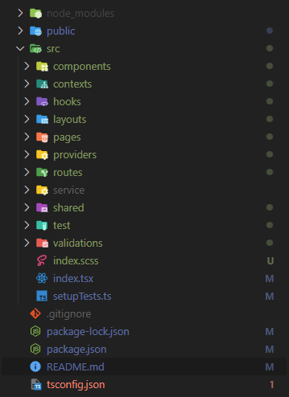

# Getting Started with React

This project was bootstrapped with [Create React App](https://github.com/facebook/create-react-app). and modfied by [Nithin P B](https://github.com/nithinpachday).

## how does it differ from `create-react-app` default configurations?

create-react-app does not includes any folder hierarchy to the project or it does not include other library's required for development. but this include all basic common libs required to run web application, which includes `react-router-dom`, `axios`, `sass` and a good matured folder hierarchy that scales to an enterprise application.

## Folder hierarchy

### contexts

all custom react contexts

### hooks

all custom hooks

### providers

configurations which should apply to child components, for example there could be multiple contexts need to be added at the top level, providers can be used for this purpose

### layouts

Layouts are the starting point of the project. layout page defines the overall page layout. here you can include header, footer, navbars, also it contains the router for navigation into other pages

### pages

Pages are groups of components which are part of a single web page

### components

Components are the smallest individual react component, which can be reused accordingly

### shared

Shared are the components which is extensively reused, like a button component

### routes

this is where all the routes include

### services

all api related functions can be found here

### test

test cases

## Available Scripts

In the project directory, you can run:

### `npm start`

Runs the app in the development mode.\
Open [http://localhost:3000](http://localhost:3000) to view it in the browser.

The page will reload if you make edits.\
You will also see any lint errors in the console.

### `npm test`

Launches the test runner in the interactive watch mode.\
See the section about [running tests](https://facebook.github.io/create-react-app/docs/running-tests) for more information.

### `npm run build`

Builds the app for production to the `build` folder.\
It correctly bundles React in production mode and optimizes the build for the best performance.

The build is minified and the filenames include the hashes.\
Your app is ready to be deployed!

See the section about [deployment](https://facebook.github.io/create-react-app/docs/deployment) for more information.

### `npm run eject`

**Note: this is a one-way operation. Once you `eject`, you can’t go back!**

If you aren’t satisfied with the build tool and configuration choices, you can `eject` at any time. This command will remove the single build dependency from your project.

Instead, it will copy all the configuration files and the transitive dependencies (webpack, Babel, ESLint, etc) right into your project so you have full control over them. All of the commands except `eject` will still work, but they will point to the copied scripts so you can tweak them. At this point you’re on your own.

You don’t have to ever use `eject`. The curated feature set is suitable for small and middle deployments, and you shouldn’t feel obligated to use this feature. However we understand that this tool wouldn’t be useful if you couldn’t customize it when you are ready for it.

## Learn More

You can learn more in the [Create React App documentation](https://facebook.github.io/create-react-app/docs/getting-started).

To learn React, check out the [React documentation](https://reactjs.org/).
